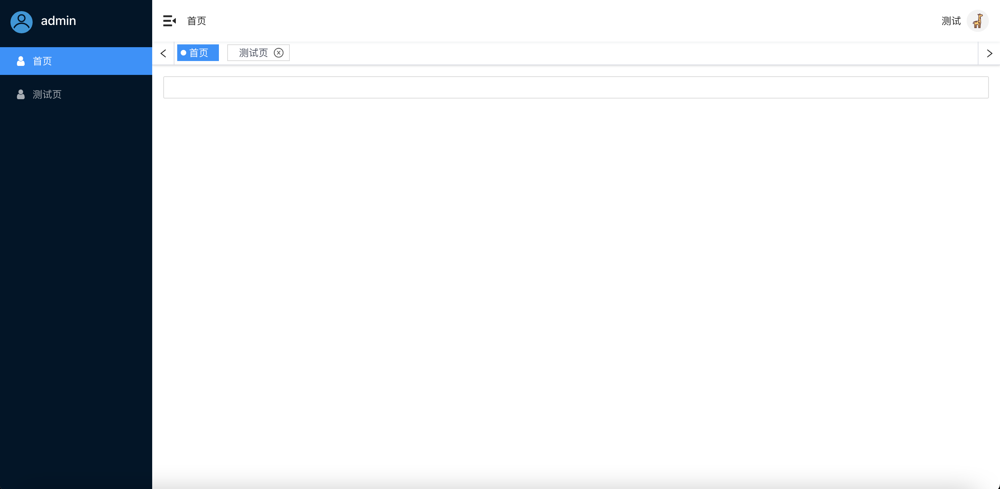

# antd-deer-ui 基于antd封装的ui库
- react+typescript+antd
- 开发预览web使用storybook做组件文档工具
-  rollup.js做组件打包dist jest.js做单元测试工具<br>
   [在线可操作文档](http://g_guojq.gitee.io/antd-deer-ui)
## Layout



基于antd构建的管理后台ui模版

### 可配置化菜单
用户只需提供以下格式结构数据，菜单即可生成。支持小分辨率自适应。
```ts
// 数据结构
export interface RouteItem {
  path: string;
  exact: boolean;
  meta: {
    tabFixed?: boolean;
    isCache?: boolean;
    hidden?: boolean;
    name: string;
    icon: Function | string;
  };
  component: ComponentType;
  routes?: Array<RouteItem>;
}
// 例子
const routeItems = [
  {
    path: '/home',
    exact: true,
    meta: {
      tabFixed: true,
      isCache: true,
      icon: 'iconuser',
      name: '首页',
    },
    component: () => <div>home</div>,
  },
  {
    path: '/test',
    exact: true,
    meta: {
      isCache: true,
      icon: 'iconuser',
      name: '测试页',
    },
    component: () => <div>test</div>,
  },
]
```
### 可缓存tab页
####根据用户点击菜单，增加tab，用户可对tab进行关闭、刷新操作（仅缓存路由情况使用）
####props
```ts
export interface LayoutProps {
  style?: React.CSSProperties;
  className?: string;
  /**
   *  图标
   */
  logo?: any;
  /**
   *  项目名
   */
  proName?: string;
  /**
   * aliveControl 路由缓存函数，若要使用请安装[react-router-cache-route](https://github.com/CJY0208/react-router-cache-route)
   * 替换react-router-dom中Switch=>CacheSwitch,Route=>CacheRoute,并将dropByCacheKey、refreshByCacheKey方法放入该对象导入。导入改对象后默认开启路由缓存功能。
   */
  aliveControl?: aliveControlInterface;
  /**
   *  路由表
   */
  routeItems: Array<RouteItem>;
  /**
   * history 对象
   */
  history: History;
  /**
   *  用户名
   */
  username: string;
  /**
   *  退出函数
   */
  onClickDrop: () => void;
}
```
#### 非缓存使用
```tsx
const myHistory = createHashHistory()

const routeItems = [
  {
    path: '/home',
    exact: true,
    meta: {
      tabFixed: true,
      isCache: true,
      icon: 'iconuser',
      name: '首页',
    },
    component: () => <div>首页</div>,
  },
  {
    path: '/test',
    exact: true,
    meta: {
      isCache: true,
      icon: 'iconuser',
      name: '测试页',
    },
    component: () => <div>
      test
    </div>,
  },
]

const Routes = () => {
  const renderRoutes = () => {
    let routes = []
    const routeMap = (arr) => {
      arr.forEach(route => {
        if (!route.meta.hidden) {
          routes.push(
            <Route
              when={() => !!route.meta.isCache}
              cacheKey={route.path}
              key={route.path}
              exact={route.exact}
              path={route.path}
              component={route.component}
            />,
          )
        }
        if (route.routes && route.routes.length) routeMap(route.routes)
      })
    }
    routeMap(routeItems)
    return routes
  }
  return (
    <Router history={myHistory}>
      <Switch>
        <Layout
          aliveControl={aliveControl}
          routeItems={routeItems}
          username={'测试'}
          proName={'admin'}
          history={myHistory}
          onClickDrop={() => {}}>
          {renderRoutes()}
        </Layout>
      </Switch>
    </Router>
  )
}
```
#### 缓存路由
```tsx
// yarn add react-router-cache-route or npm install react-router-cache-route
import {CacheRoute, CacheSwitch, refreshByCacheKey, dropByCacheKey} from 'react-router-cache-route'

const Routes = () => {
  const renderRoutes = () => {
    let routes = []
    const routeMap = (arr) => {
      arr.forEach(route => {
        if (!route.meta.hidden) {
          routes.push(
            <CacheRoute  // 替换Route => CacheRoute
              when={() => !!route.meta.isCache}
              cacheKey={route.path}
              key={route.path}
              exact={route.exact}
              path={route.path}
              component={route.component}
            />,
          )
        }
        if (route.routes && route.routes.length) routeMap(route.routes)
      })
    }
    routeMap(routeItems)
    return routes
  }
  return (
    <Router history={myHistory}>
      <CacheSwitch> // 替换 Switch => CacheSwitch
        ...
      </CacheSwitch>
    </Router>
  )
}
```
### 面包屑
提供页面层级关系。